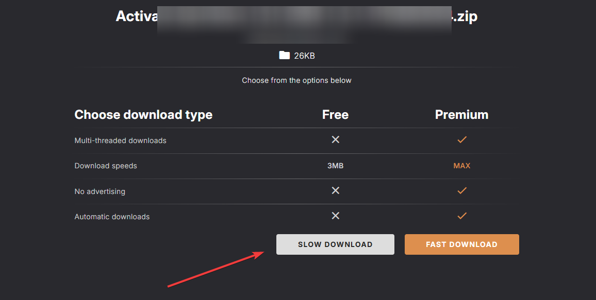
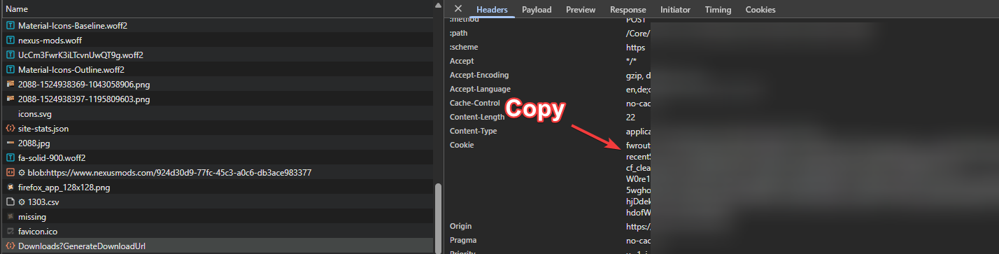

# Fork Information

In this Release I have implemented the functionality that nexus update also works with non premium account.

Just update session.txt (next to Stardrop.exe) with your session Cookie which usually looks like this (Omitted some of it):

fwroute=1746959198.828.20660.220449|b...dofWOlI; ab=0|1746962235

You can get the session token when opening the network path of your browser and go to any mod and click "Slow Download":

In Network path under Downloads?GenerateDownloadUrl copy whole Cookie text:

I have overwritten the logic for premium download so don't use this if you have nexus premium.

# Stardrop

Stardrop is an open-source, cross-platform mod manager for the game [Stardew Valley](https://www.stardewvalley.net/). It is built using the Avalonia UI framework.

Stadrop utilizes [SMAPI (Stardew Modding API)](https://smapi.io/) to simplify the management and update checking for all applicable Stardew Valley mods.

Profiles are also supported, allowing users to have multiple mod groups for specific gameplay or multiplayer sessions.

# Getting Started

See the [GitBook pages](https://floogen.gitbook.io/stardrop/) for detailed documentation on how to install, update and use Stardrop.

## Downloading Stardrop

See the [release page](https://github.com/Floogen/Stardrop/releases/latest) for the latest builds.

# Credits

## Translations

Stardrop has been generously translated into several languages by the following users:

- **Chinese** - guanyintu, PIut02, Z2549, CuteCat233
- **French** - xynerorias
- **German** - Schn1ek3
- **Hungarian** - martin66789
- **Italian** - S-zombie
- **Portuguese** - aracnus
- **Russian** - Rongarah
- **Spanish** - Evexyron, Gaelhaine
- **Thai** - ellipszist
- **Turkish** - KediDili
- **Ukrainian** - burunduk, ChulkyBow

# Gallery

